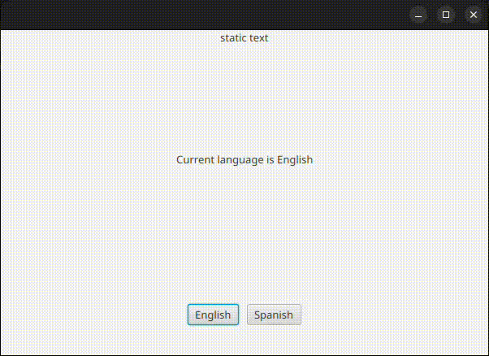

```markdown


```

# language-manager
**Language Manager** is a JavaFX library that enables **dynamic language switching at runtime**, allowing you to update the application language without needing to refresh the scene.

## ✨ Features

- 🌍 Support for multiple languages using standard `.properties` files.
- 🔄 Change language on the fly without reloading scenes.
- 🔗 Automatic binding for `Label`, `Button`, `TextField`, and other controls using `@FXML` ids.
- ⚙️ Custom annotations to ignore specific fields from auto-binding.
- 📦 Lightweight and easy to integrate.

## 📦 Installation

Add the library to your project using Maven or Gradle

### Maven
Add the following to your `pom.xml`:
```xml
<dependency>
    <groupId>io.github.snoopy137</groupId>
    <artifactId>language-manager</artifactId>
    <version>1.0.0</version>
</dependency>
```
### Gradle
Add this to your `build.gradle`:
```groovy
dependencies {
    implementation 'io.github.snoopy137:language-manager:1.0.0'
}
```

## 📁 File Structure

Place your resource bundles in the `src/main/resources` folder:

```text
src/
└── main/
    └── resources/
        ├── language.properties         # Default (English)
        ├── language_es.properties      # Spanish
        └── language_fr.properties      # French
```

## 🚀 Usage

### 1. Bind Your Controls

In your FXML controller:

```java
@FXML
private Label greeting;

public void initialize() {
    Language.autoBind(this); // Automatically binds the 'greeting' Label
}
```

### 2. Change Language Dynamically

```java
Language.setLocale(Locale.forLanguageTag("es")); // Switch to Spanish
```

### 3. Fallback Handling

If the desired language file doesn't exist, the system automatically falls back to the default language.properties. You can customize or log this behavior in your own Language.getBundle() method.

### 4. Ignore Specific Fields

Use the @IgnoreBind annotation to skip certain controls from being automatically bound.
```java
@FXML @IgnoreBind
private Label customLabel;
```

### 📸 Demo



🔧 Under the Hood

Language Manager leverages ResourceBundle, SimpleObjectProperty, and Bindings to keep text in sync with the selected locale — all while avoiding the need to reinitialize scenes.

📄 License

MIT License

📚 [View Javadocs](https://snoopy137.github.io/language-manager/)

## 🤝 Contributing

We welcome contributions! Please fork the repository and submit a pull request with your changes.

## 🐞 Issues

If you encounter any bugs or have feature requests, please open an issue in the [GitHub Issues](https://github.com/snoopy137/language-manager/issues) section.


## 🔖 Versioning

We follow [Semantic Versioning](https://semver.org/) for our releases. You can check out the release notes for each version on the [Releases Page](https://github.com/snoopy137/language-manager/releases).

